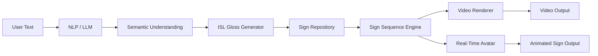

# SignAI — AI-Powered Text-to-Indian Sign Language Translation

## Project Overview
SignAI takes English text, turns it into an intermediate sign-language gloss, looks each gloss up in a sign repository, builds a timed sign sequence, and plays it in a browser (video or animated avatar placeholder).

## Problem Statement
Most deaf and hard-of-hearing people in India use ISL, and written English is often a second language. Text-to-sign tools that swap words one-to-one lose grammar and meaning.

## Proposed Solution
An NLP/LLM layer analyses the sentence (intent, entities, time, negation, questions) and emits a reordered gloss. Rendering is separated from linguistics so each stage can be replaced independently.

## Architecture


## Technology Stack
React, Vite, TypeScript, Tailwind CSS, Framer Motion, Axios · Python, FastAPI, Pydantic, Uvicorn · FFmpeg (video).

## Folder Structure
`backend/api` routes · `backend/services` llm, gloss, sign repository, sequence, video · `backend/models` Pydantic schemas · `backend/data/signs` sign database · `frontend/src` components, hooks, services.

## Installation
Backend (Python 3.11+):
```bash
cd backend
pip install -r requirements.txt
```
Frontend (Node 18+):
```bash
cd frontend
npm install
```
Docker alternative (optional): `docker compose up --build`, then open http://localhost:5173.

## Environment Variables
Copy `.env.example` to `.env`. `LLM_PROVIDER=mock` needs no key. `LLM_PROVIDER=api` uses `LLM_API_KEY` and `LLM_MODEL` (Anthropic Messages API). If the API call fails, the app falls back to mock rules and tells the user. Keys are only read by the backend.

## Running Backend
```bash
cd backend
uvicorn main:app --reload --port 8000
pytest
```

## Running Frontend
```bash
cd frontend
npm run dev      # http://localhost:5173, proxies /api to :8000
npm run build
```

## API Documentation
- `GET /api/health` → `{"status":"ok","service":"signai"}`
- `POST /api/translate` `{text, source_language, target_sign_language}` → gloss, intent, entities, sequence[], unknown_signs[], confidence, engine, notice. Empty text → 422 `{"error":"Please enter a sentence."}`.
- `POST /api/generate-video` `{sequence:[gloss,...]}` → `{video_url}`; 422 if no video assets exist.
- `WS /api/translate/stream` send `{text}`; receive `understanding`, one `sign` per sign, then `done` (or `error`).

## Demo
Enter "I am going to college tomorrow." → gloss `TOMORROW I COLLEGE GO`. The sign list contains 40 demo entries with no recorded video. The renderer is labelled "Demo Sign Renderer — not an actual ISL sign".

## Sign Dataset Integration
Edit `backend/data/signs/signs.json`; each entry: `id, gloss, asset_type ("demo" or "dataset"), video, keypoints`. Put clips under `backend/data/signs/` and reference them relative to that folder. Keep licence and attribution alongside each asset. To use a database or vector store, implement the `SignRepository` interface in `services/sign_repository.py` and change `get_repository()`. Video generation concatenates clips with FFmpeg once real `video` files exist.

## AI Pipeline
Real AI: only in `LLM_PROVIDER=api` mode (gloss and intent from a language model, validated with Pydantic, malformed JSON recovered). Mock mode: deterministic phrases plus a small reordering rule set (time, objects, verb, negation, question word). Neither is a validated ISL grammar.

## Speech Input
The input panel has two modes: **Type** and **Speak**. In Speak mode the browser's Web Speech API converts speech to text (`useSpeech` hook), the text appears in the box, and it is then translated exactly like typed input. Works in Chrome, Edge and Safari; Firefox is unsupported and the Speak option is disabled. Chrome sends audio to an online speech service, so it needs an internet connection and is not private/offline. Microphone access requires `localhost` or HTTPS. Recognition quality for Indian English varies; the transcript is editable before re-translating.

## Limitations
- No real ISL assets are bundled; playback shows text labels.
- Gloss ordering is approximate and not reviewed by ISL linguists.
- Mock rules cover simple English only.
- Real-time mode streams the sequence over WebSocket; sign generation is instant, so its benefit shows once assets are heavy.
- Speech input is not implemented.

## Future Work
Replace `SignSequenceService` with a neural `SignGenerator` (gloss → pose sequence), retarget poses to a GLTF avatar in Three.js, train or fine-tune on an ISL dataset, add ISL-specific grammar evaluation with native signers.
